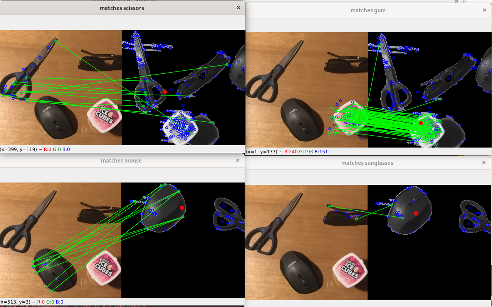

# opencv-projects
This repo has a project that is used for detecting objects (scissors, sunglasses, gum container, mouse) using opencv. There is a background image, an image with all the objects, and 5 images with objects to be detected.
It works by:
1. Using subtraction to remove the background.
2. It uses blur and threshold to create a binary image outlining the objects.
3. It removes the small contours and uses dilation and erosion to keep only the large objects we want.
4. It exacts the SIFT keypoints of the baseline and target images.
5. It uses a Flann-basd matcher to match keypoints in the baseline and target images.
6. It finds the centroids of the matched keypoints to find the objects' locations. It marks these locations in red.

Here is a sample output, with each window being for a different object. The image on the left is the baseline image with the object's keypoints. The image on the right is the image being detected. 3 of the 4 detections are correct.

